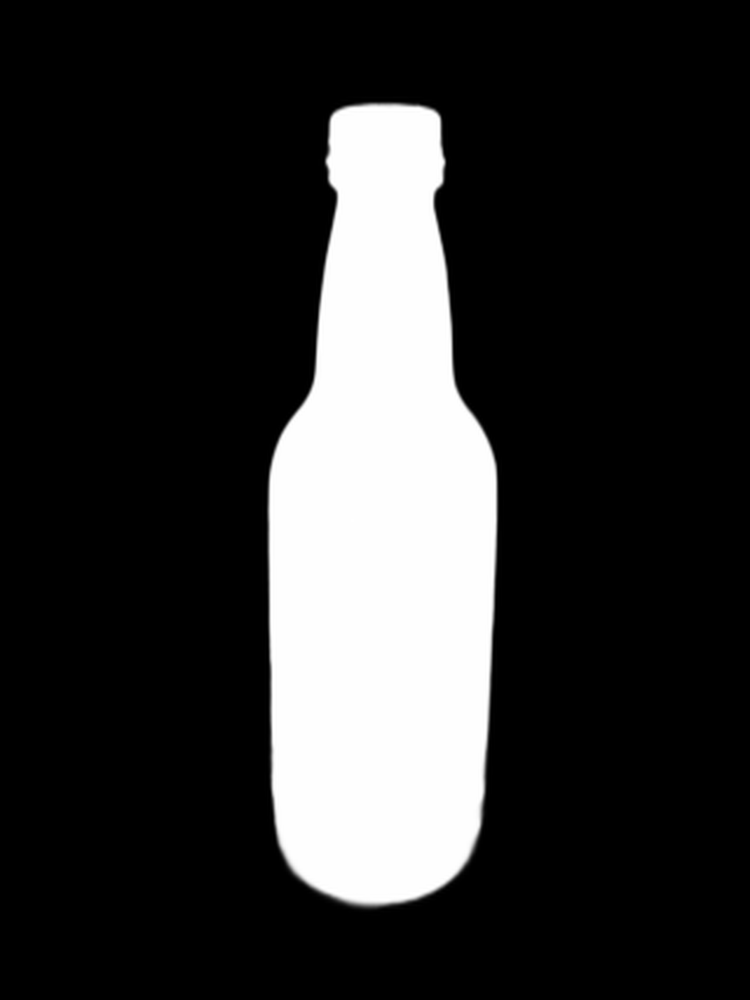

# Composite an image with the background removed with rembg with the original image

Create a mask from an image with the background removed by rembg. Next, the original image is converted to black and white. Finally, the converted black-and-white image is masked and combined with the original background.

rembgで背景を削除した画像からマスクを作成します。次にオリジナル画像を白黒に変換します。最後に白黒画像に変換した画像をマスク処理して元の背景と合成します。

- Python 3.9.1

## Usage / 使い方

### Create a directory to store images.

画像を保存するディレクトリを作成

	mkdir original combine
### Install Library form requirements.txt.

requirements.txtからライブラリをインストール

	pip install -r requirements.txt
	
## Sample usage / 実行方法

	python combine-background.py

## Result / 結果

1. Create Mask from image with background removed by rembg.（rembgで背景を削除した画像からMaskを作成）
2. Convert original image to grayscale.（オリジナル画像をグレースケールに変換）
3. Composite the original image, B&W image, and Mask.（オリジナル画像、白黒画像、マスクを合成）

| Original                 | rembg                     | Mask                 | Gray                 |
|--------------------------|---------------------------|----------------------|----------------------|
|  |  |  |  |

composite image

## Author / 作成者
**nobnov (Nobukazu Ishii)**

- [Twitter](https://twitter.com/nobnov)
- [Facebook](https://www.facebook.com/nobnov.ISHII)